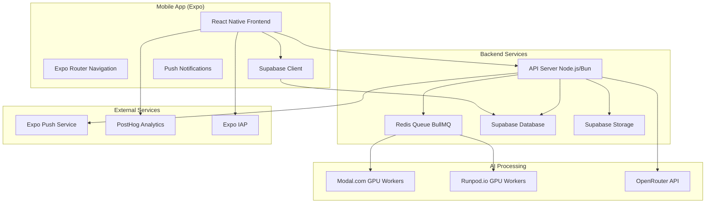

# Design Document

## Overview

The AI Video Generation App is a production-grade mobile application built with Expo (React Native) and Supabase that provides AI-powered video and image generation capabilities. The system architecture follows a client-server model with a mobile frontend, scalable backend API, and GPU-based processing infrastructure. The application supports social features, personalized model training, credit-based monetization, and real-time notifications.

## Architecture

### High-Level Architecture



### Technology Stack

**Frontend (Mobile)**
- Expo SDK 53+ with React Native 0.79+
- Expo Router for navigation
- Supabase JS client for authentication and data
- Expo AV for video playback
- Expo Camera for image capture
- Expo IAP for in-app purchases
- PostHog for analytics

**Backend (API Server)**
- Node.js or Bun runtime
- Express.js or Fastify framework
- BullMQ for job queue management
- Redis (Upstash) for queue storage
- Supabase service role for database operations
- Zod for schema validation

**Infrastructure**
- Supabase for database, authentication, and storage
- Modal.com and Runpod.io for GPU processing
- Upstash Redis for job queues
- Expo Push Notifications service
- PostHog for analytics and monitoring

## Components and Interfaces

### Frontend Components

#### Navigation Structure
```
app/
├── _layout.tsx (Root layout with AuthProvider)
├── index.tsx (Auth redirect logic)
├── (auth)/
│   ├── login.tsx
│   ├── signup.tsx
│   └── _layout.tsx
└── (tabs)/
    ├── feed.tsx (Social feed)
    ├── video.tsx (Video generation)
    ├── image.tsx (Image generation)
    ├── training.tsx (Model training)
    ├── profile.tsx (User profile)
    └── _layout.tsx (Tab navigation)
```

#### Core Components

**AuthContext**
- Manages user authentication state
- Handles OAuth providers (Google, Facebook, Twitter)
- Provides session management across app

**VideoPlayer**
- Handles video playback with controls
- Supports looping and muting
- Optimized for feed scrolling

**GenerationComponents**
- `ImageGenerator`: Text-to-image generation interface
- `VideoGenerator`: Text/image-to-video generation interface
- `ImageEditor`: Masking and editing tools
- `TrainingUploader`: Photo upload and training configuration

**UI Components**
- `Button`: Consistent button styling
- `LoadingOverlay`: Loading states for async operations
- `CreditDisplay`: Real-time credit balance
- `NotificationBanner`: In-app notifications

### Backend API Endpoints

#### Authentication Endpoints
```typescript
POST /auth/refresh - Refresh JWT tokens
POST /auth/logout - Logout user
GET /auth/profile - Get user profile with credits
```

#### Generation Endpoints
```typescript
POST /generate/image - Create image generation job
POST /generate/video - Create video generation job
GET /generate/:jobId - Get generation job status
POST /generate/:jobId/cancel - Cancel generation job
```

#### Training Endpoints
```typescript
POST /train/upload - Upload training images
POST /train/start - Start LoRA training job
GET /train/:jobId - Get training job status
GET /train/models - List user's trained models
```

#### Social Endpoints
```typescript
GET /feed - Get paginated social feed
POST /content/:id/like - Like/unlike content
POST /content/:id/comment - Add comment
GET /content/:id/comments - Get comments
POST /content/share - Share content
```

#### Credit & IAP Endpoints
```typescript
GET /credits/balance - Get current credit balance
POST /credits/purchase - Initiate credit purchase
POST /webhooks/iap - Handle IAP receipt validation
GET /subscription/status - Get subscription status
POST /subscription/manage - Manage subscription
```

### Queue System Architecture

#### Job Types
```typescript
interface ImageGenerationJob {
  type: 'image_generation';
  userId: string;
  prompt: string;
  model: string;
  quality: 'basic' | 'standard' | 'high';
  credits: number;
}

interface VideoGenerationJob {
  type: 'video_generation';
  userId: string;
  prompt: string;
  inputType: 'text' | 'image' | 'keyframe';
  inputData: any;
  credits: number;
}

interface TrainingJob {
  type: 'model_training';
  userId: string;
  images: string[];
  steps: 600 | 1200 | 2000;
  modelName: string;
  credits: number;
}
```

#### Queue Configuration
- **High Priority Queue**: Credit purchases, user actions
- **Medium Priority Queue**: Image generation
- **Low Priority Queue**: Video generation, model training
- **Retry Logic**: Exponential backoff with max 3 retries
- **Dead Letter Queue**: Failed jobs for manual review

## Data Models

### Database Schema

#### Users Table (Extended)
```sql
CREATE TABLE users (
  id UUID PRIMARY KEY DEFAULT gen_random_uuid(),
  email TEXT UNIQUE NOT NULL,
  username TEXT UNIQUE,
  credits INTEGER DEFAULT 100,
  subscription_status TEXT DEFAULT 'free',
  subscription_expires_at TIMESTAMP,
  iap_user_id TEXT,
  created_at TIMESTAMP DEFAULT NOW(),
  updated_at TIMESTAMP DEFAULT NOW()
);
```

#### Videos Table
```sql
CREATE TABLE videos (
  id UUID PRIMARY KEY DEFAULT gen_random_uuid(),
  user_id UUID REFERENCES users(id) ON DELETE CASCADE,
  prompt TEXT NOT NULL,
  generation_type TEXT NOT NULL, -- 'text_to_video', 'image_to_video', 'keyframe'
  input_data JSONB,
  video_url TEXT,
  thumbnail_url TEXT,
  status TEXT DEFAULT 'pending',
  credits_used INTEGER,
  likes_count INTEGER DEFAULT 0,
  comments_count INTEGER DEFAULT 0,
  is_public BOOLEAN DEFAULT true,
  created_at TIMESTAMP DEFAULT NOW()
);
```

#### Images Table
```sql
CREATE TABLE images (
  id UUID PRIMARY KEY DEFAULT gen_random_uuid(),
  user_id UUID REFERENCES users(id) ON DELETE CASCADE,
  prompt TEXT NOT NULL,
  negative_prompt TEXT,
  model TEXT NOT NULL,
  image_url TEXT,
  width INTEGER,
  height INTEGER,
  quality TEXT,
  credits_used INTEGER,
  is_public BOOLEAN DEFAULT true,
  created_at TIMESTAMP DEFAULT NOW()
);
```

#### Training Jobs Table
```sql
CREATE TABLE training_jobs (
  id UUID PRIMARY KEY DEFAULT gen_random_uuid(),
  user_id UUID REFERENCES users(id) ON DELETE CASCADE,
  model_name TEXT NOT NULL,
  training_images TEXT[], -- Array of image URLs
  steps INTEGER NOT NULL,
  status TEXT DEFAULT 'pending',
  progress INTEGER DEFAULT 0,
  trained_model_url TEXT,
  credits_used INTEGER,
  error_message TEXT,
  created_at TIMESTAMP DEFAULT NOW(),
  completed_at TIMESTAMP
);
```

#### IAP Receipts Table
```sql
CREATE TABLE iap_receipts (
  id UUID PRIMARY KEY DEFAULT gen_random_uuid(),
  user_id UUID REFERENCES users(id) ON DELETE CASCADE,
  receipt_data TEXT NOT NULL,
  product_id TEXT NOT NULL,
  transaction_id TEXT UNIQUE NOT NULL,
  credits_granted INTEGER,
  status TEXT DEFAULT 'pending',
  processed_at TIMESTAMP,
  created_at TIMESTAMP DEFAULT NOW()
);
```

#### Push Tokens Table
```sql
CREATE TABLE push_tokens (
  id UUID PRIMARY KEY DEFAULT gen_random_uuid(),
  user_id UUID REFERENCES users(id) ON DELETE CASCADE,
  token TEXT NOT NULL,
  platform TEXT NOT NULL, -- 'ios' or 'android'
  is_active BOOLEAN DEFAULT true,
  created_at TIMESTAMP DEFAULT NOW(),
  updated_at TIMESTAMP DEFAULT NOW()
);
```

#### Social Interactions Tables
```sql
CREATE TABLE likes (
  id UUID PRIMARY KEY DEFAULT gen_random_uuid(),
  user_id UUID REFERENCES users(id) ON DELETE CASCADE,
  content_id UUID NOT NULL, -- Can reference videos or images
  content_type TEXT NOT NULL, -- 'video' or 'image'
  created_at TIMESTAMP DEFAULT NOW(),
  UNIQUE(user_id, content_id, content_type)
);

CREATE TABLE comments (
  id UUID PRIMARY KEY DEFAULT gen_random_uuid(),
  user_id UUID REFERENCES users(id) ON DELETE CASCADE,
  content_id UUID NOT NULL,
  content_type TEXT NOT NULL,
  comment_text TEXT NOT NULL,
  created_at TIMESTAMP DEFAULT NOW()
);
```

### Row Level Security (RLS) Policies

```sql
-- Users can only read/update their own profile
ALTER TABLE users ENABLE ROW LEVEL SECURITY;
CREATE POLICY "Users can view own profile" ON users FOR SELECT USING (auth.uid() = id);
CREATE POLICY "Users can update own profile" ON users FOR UPDATE USING (auth.uid() = id);

-- Public content is viewable by all, private content only by owner
ALTER TABLE videos ENABLE ROW LEVEL SECURITY;
CREATE POLICY "Public videos are viewable by all" ON videos FOR SELECT USING (is_public = true);
CREATE POLICY "Users can view own videos" ON videos FOR SELECT USING (auth.uid() = user_id);
CREATE POLICY "Users can insert own videos" ON videos FOR INSERT WITH CHECK (auth.uid() = user_id);

-- Similar policies for images, training_jobs, etc.
```

## Error Handling

### Frontend Error Handling

#### Network Errors
- Implement retry logic with exponential backoff
- Show user-friendly error messages
- Offline mode with cached content
- Connection status indicators

#### Generation Errors
- Credit insufficient warnings
- Generation failure notifications
- Retry options for failed generations
- Progress indicators with error states

#### Authentication Errors
- OAuth callback error handling
- Session expiration management
- Automatic token refresh
- Fallback to email/password auth

### Backend Error Handling

#### API Error Responses
```typescript
interface APIError {
  code: string;
  message: string;
  details?: any;
  timestamp: string;
}

// Standard error codes
const ERROR_CODES = {
  INSUFFICIENT_CREDITS: 'INSUFFICIENT_CREDITS',
  GENERATION_FAILED: 'GENERATION_FAILED',
  INVALID_INPUT: 'INVALID_INPUT',
  RATE_LIMITED: 'RATE_LIMITED',
  SERVICE_UNAVAILABLE: 'SERVICE_UNAVAILABLE'
};
```

#### Queue Error Handling
- Failed job retry with exponential backoff
- Dead letter queue for manual intervention
- Credit refund for failed generations
- User notification for permanent failures

#### GPU Service Error Handling
- Fallback between Modal.com and Runpod.io
- Service health monitoring
- Automatic failover mechanisms
- Load balancing across providers

## Testing Strategy

### Frontend Testing

#### Unit Tests
- Component rendering tests with React Native Testing Library
- Hook testing for custom hooks (useAuth, etc.)
- Utility function tests
- Navigation flow tests

#### Integration Tests
- Authentication flow end-to-end
- Generation workflow testing
- IAP purchase flow testing
- Push notification handling

#### E2E Tests
- Critical user journeys with Detox
- Cross-platform testing (iOS/Android)
- Performance testing for video playback
- Offline functionality testing

### Backend Testing

#### Unit Tests
- API endpoint testing with Jest/Vitest
- Queue job processing tests
- Database operation tests
- Credit calculation tests

#### Integration Tests
- GPU service integration tests
- Supabase integration tests
- Redis queue integration tests
- Push notification delivery tests

#### Load Testing
- API endpoint load testing
- Queue processing capacity tests
- Database performance under load
- GPU service scaling tests

### Testing Infrastructure

#### Test Data Management
- Seeded test database with realistic data
- Mock GPU services for testing
- Test user accounts with various states
- Automated test data cleanup

#### CI/CD Pipeline
- Automated testing on pull requests
- Cross-platform build testing
- Performance regression testing
- Security vulnerability scanning

## Security Considerations

### Authentication & Authorization
- JWT token validation on all protected endpoints
- Row Level Security (RLS) for data access
- OAuth provider security best practices
- Session management and token refresh

### Data Protection
- Encryption at rest for sensitive data
- HTTPS/TLS for all API communications
- Secure storage of API keys and secrets
- PII data handling compliance

### Content Security
- Image/video content moderation
- Prompt filtering for inappropriate content
- User-generated content policies
- DMCA compliance procedures

### Infrastructure Security
- API rate limiting and DDoS protection
- Input validation and sanitization
- SQL injection prevention
- Cross-site scripting (XSS) protection

## Performance Optimization

### Frontend Performance
- Image lazy loading and caching
- Video preloading for smooth playback
- Component memoization for heavy renders
- Bundle size optimization

### Backend Performance
- Database query optimization with indexes
- Redis caching for frequently accessed data
- API response compression
- Connection pooling for database

### Media Delivery
- CDN integration for fast media delivery
- Progressive image loading
- Video streaming optimization
- Thumbnail generation and caching

### Monitoring & Analytics
- Real-time performance monitoring
- Error tracking and alerting
- User behavior analytics
- Resource usage monitoring